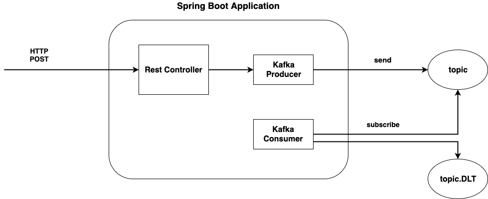

## Spring Boot Application With Kafka Example

A sample application which demonstrates how to use `KafkaTemplate` to send message to Kafka Topic within a transaction and how message is received by the Kafka Consumer.


### High Level Architecture



#### Assumptions
* It is assumed that Kafka Topic `custom` and DeadLetterTopic `custom.DLT` already exist instead of being created by the application itself.
* For comparison only, a separate producer and consumer are configured and expect a topic with the name `simple` to exist. This topic expects message payload to be a of type `String`.

#### Message Flow
* A HTTP Post request is send to the application with payload in JSON format.
* Upon receiving such request, a message is sent to the topic which includes the payload as message body.
* Consumer is notified when message arrives and begins processing. If error occurs such as message cannot be converted, a retry will happen until `maxFailure` times. In such case, message is sent to the `DLT` for further inspection.


#### Design Ideas
* Instead of processing incoming HTTP request using the same thread, a response is sent back to the caller as soon as the request is being sent to the Kafka Topic. This decoupling allows the application to scale up without the processing becomes the bottleneck.
* A separate thread (consumer) can listen to the topic and begin processing. Processing can be scaled up by adding more consumers.  

### HTTP Endpoints

* HTTP POST to `/message` with any string as payload. 
    * this is for working with `simple` topic which expects message to be string

* HTTP POST to `/custom-message` with JSON payload
    * this is for working with `custom` topic which expects message to have the following format

        ```json
        {
          "message": "any-message"
        }
        ``` 
    

### Configuration

#### Transaction


Inside `postMessage` method of `CustomMessageProducerService` class, we are using `kafkaTemplate.executeInTransaction` method to wrap around the code which sends message.

Wrapping the code within a transaction is not strictly necessary in order to send the message. It is being used here for illustration purpose.

On the producer side, we set the transaction id prefix to enable transaction.

```
factory.setTransactionIdPrefix("tx-");
```

On the consumer side, we configure consumer configuration property `isolation.level` to be `read_committed`. 

```
props.put(ConsumerConfig.ISOLATION_LEVEL_CONFIG, "read_committed");
```

#### Error Handling

We can configure an error handler in the listener container to perform other action.

>The SeekToCurrentErrorHandler discards remaining records from the poll() and performs seek operations on the consumer to reset the offsets so that the discarded records are fetched again on the next poll

The failed record can be sent to a DeadLetterTopic for further inspection.


#### Deserialization Error

Using `ErrorHandlingDeserializer2` can wrap a delegate deserializer such as `StringDeserializer` and catches any exception during deserialization. Exception is forwareded to the listener container, which is sent to error handler. 

#### Message Converter

A MessageConverter `StringJsonMessageConverter` is configured to convert from String to custom Java POJO. `trusted package` and `id-class mapping` are set up so that message can be converted into POJO.


#### Bootstrap Server Location
* `application.yaml` has hard-coded value which most likely doesn't work for you and has to be changed.

    ```
    bootstrapServer: 192.168.1.196:9092
    ```


### References

* [How to Work with Apache Kafka in Your Spring Boot Application](https://www.confluent.io/blog/apache-kafka-spring-boot-application)
* [Spring for Apache Kafka Deep Dive – Part 1: Error Handling, Message Conversion and Transaction Support](https://www.confluent.io/blog/spring-for-apache-kafka-deep-dive-part-1-error-handling-message-conversion-transaction-support)